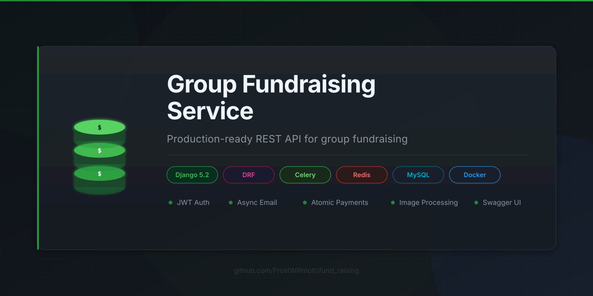

<div align="center">
  
</div>

# Group Fundraising Service

[](https://github.com/FrostWillmott/fund_raising/actions/workflows/ci.yml)
[](https://github.com/FrostWillmott/fund_raising/actions/workflows/ci.yml)
[](https://www.python.org/)
[](https://www.djangoproject.com/)
[](LICENSE)
[](https://github.com/pre-commit/pre-commit)
[](https://github.com/astral-sh/ruff)
[](https://www.docker.com/)

A production-ready REST API for group fundraising with JWT authentication,
image processing, cache invalidation, and asynchronous email notifications.
The project focuses on practical backend concerns: transactional safety,
permissions, query optimization, and maintainable environment-based settings.

## What's inside

**Core stack:** Django 5.2, Django REST Framework, MySQL, Redis, Celery

**Features:**
- JWT authentication via djoser + simplejwt (not mentioned in the spec)
- Separate dev/prod settings with environment-specific email, DB, and debug config
- Service layer (`collects/services.py`, `payments/services.py`): creation
  lifecycle — transaction, forced payment status, atomic `collected_amount`
  increment via `F()` expressions, post-commit email and cache invalidation —
  lives in one place per domain
- Domain validation where money moves: positive amounts only, no donations
  to inactive or expired collects, `end_date` must be after `start_date`
- Race-safe `transaction_id` uniqueness: serializer check for a clear error
  message, plus `IntegrityError` → 400 for concurrent duplicates
- Collect list/detail responses cached for 60 s with working invalidation:
  `cache_page(key_prefix=...)` puts a matchable literal into the cache key,
  `delete_pattern` removes it on every write; a Redis outage degrades to
  uncached responses instead of 500s (`IGNORE_EXCEPTIONS`)
- Payments are private to the payer: list/retrieve are payer-scoped and not
  shared-cached
- A collect with payment history cannot be deleted — friendly 400 at the API
  layer, `on_delete=PROTECT` as the DB-level backstop
- Celery email tasks with bounded retries (`autoretry_for` + exponential
  backoff, max 3 attempts); a broker outage after commit is logged, not
  turned into a 500
- Cover image processing: auto-resize to 1200×800, JPEG optimization, format
  validation, 2MB size limit, auto-cleanup of old files on update
- Custom permission classes with inheritance (`IsOwnerOrReadOnly` →
  `IsCollectAuthorOrReadOnly`, `IsPaymentPayerOrReadOnly`)
- DB index on `(collect, status)` for payment queries
- Pagination with configurable `page_size`
- Realistic seed data: Faker with `ru_RU` locale, occasion-specific title/
  description templates, weighted payment amount distribution, batch inserts
- Poetry for dependency management, mypy + django-stubs for type checking,
  ruff for linting
- MailHog with MongoDB backend for email testing in dev

## Quick start

Prerequisites: Docker and Docker Compose.
```bash
git clone https://github.com/FrostWillmott/fund_raising.git
cd fund_raising
cp .env.example .env
docker compose up --build
```

| Service | URL |
|---|---|
| API | http://localhost:8000/api/v1/ |
| Swagger UI | http://localhost:8000/docs/ |
| MailHog | http://localhost:8025/ |

## Production deployment

Use the production override to run Django via Gunicorn and force production settings:
```bash
docker compose -f docker-compose.yml -f docker-compose.prod.yml up -d --build
```

Required production env vars:
- `SECRET_KEY`
- `ALLOWED_HOSTS`
- `CORS_ALLOWED_ORIGINS` (comma-separated origins)

## API

Authentication: JWT Bearer token.
```bash
# Get token
curl -X POST http://localhost:8000/auth/jwt/create/ \
  -H "Content-Type: application/json" \
  -d '{"username": "user", "password": "password"}'
```

Endpoints:
```
POST   /auth/users/                  — register
POST   /auth/jwt/create/             — get token
POST   /auth/jwt/refresh/            — refresh token

GET    /api/v1/collects/             — list collections (no payment feed)
POST   /api/v1/collects/             — create collection (with cover image)
GET    /api/v1/collects/{id}/        — collection detail with the 10 most recent payments
PATCH  /api/v1/collects/{id}/        — update (owner only)
DELETE /api/v1/collects/{id}/        — delete (owner only, no payments)

GET    /api/v1/payments/             — list your own payments
POST   /api/v1/payments/             — make a donation
```

Full interactive docs at `/docs/`.

## Seed data
```bash
docker compose exec web python manage.py generate_test_data \
  --users 50 --collects 100 --payments 5000
```

Generates realistic Russian-language collections (birthday, wedding,
new year, other) with occasion-specific titles and descriptions, and
payments with weighted amount distribution (50% small / 30% medium /
15% large / 5% whale).

## Project structure
```
fund_raising/
├── api/v1/
│   ├── collects/     # ViewSet (cached, list/detail serializer split)
│   └── payments/     # ViewSet (payer-scoped), serializers
├── collects/         # Model, services, signals, image utils, tasks
├── payments/         # Model, services, tasks
├── dev_tools/        # generate_test_data management command
└── fund_raising/     # Settings (base / development / production), cache helper
```

## Development
```bash
# Install git hooks (once per clone)
poetry run pre-commit install --hook-type pre-commit --hook-type pre-push

# Linting
docker compose exec web ruff check .

# Type checking
docker compose exec web mypy .

# Run hooks manually for all files
poetry run pre-commit run --all-files
```
## Tests

Tests cover the API, service and task layers:
- collection listing/creation, including cache freshness (a created collect
  appears in the list immediately) and a cache-key regression guard
- permission and visibility enforcement: owner-only writes, payer-scoped
  payment access (list and retrieve)
- domain validation: negative/zero amounts, donations to inactive or expired
  collects, `end_date` in the past, null/missing collect
- duplicate `transaction_id` rejection and delete guards (API 400 + DB PROTECT)
- query-count regression for the collect list (constant, independent of the
  number of payments) and the bounded detail feed
- cover image pipeline: size/format validation, resize, JPEG re-encoding
- payment service unit tests: counter increment, failed duplicate leaves the
  counter intact, direct ORM writes don't touch the counter
- Celery tasks: expired-collect deactivation touches only expired active
  collects; cover processing resizes and re-encodes, no-ops on a missing
  collect or cover

```bash
# Run with coverage (outputs term-missing summary + htmlcov/)
pytest

# Quick run without coverage
pytest --no-cov
```
